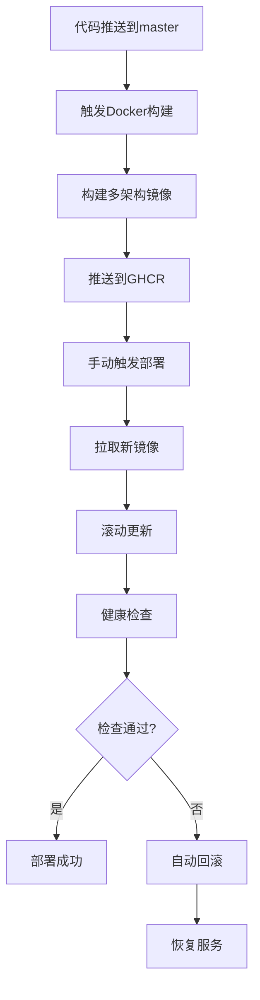

# StoryApp CI/CD 完整实施指南

## 📋 概览

本文档详细说明了StoryApp从代码提交到生产部署的完整CI/CD流程实施方案。

## 🏗️ 架构图

```
📝 代码提交 → 🔍 CI测试 → 🐳 构建镜像 → 📦 发布GHCR → 🚀 自动部署 → 📊 监控告警
    ↓              ↓           ↓            ↓            ↓            ↓
  GitHub      Playwright    Docker       GHCR       Production    Monitoring
  Actions      + Jest      Multi-stage   Registry    Server        + Alerts
```

## 🚀 工作流概览

### 1. 代码质量保证流程

| 工作流 | 触发条件 | 功能 |
|--------|----------|------|
| `pr-auto-review.yml` | PR创建/更新 | Claude Code智能代码评审 |
| `ci.yml` | 代码推送/PR | 完整CI测试（单元+E2E） |
| `codex-review.yml` | PR创建/更新 | Codex自动代码评审 |

### 2. 构建和发布流程

| 工作流 | 触发条件 | 功能 |
|--------|----------|------|
| `docker-build-push.yml` | master分支推送/标签 | 构建Docker镜像并推送到GHCR |

### 3. 部署和运维流程

| 工作流 | 触发条件 | 功能 |
|--------|----------|------|
| `deploy-production.yml` | 手动触发 | 生产环境自动部署 |
| `rollback.yml` | 手动触发 | 生产环境版本回滚 |
| `monitoring.yml` | 定时/手动 | 生产环境健康监控 |

## 🔧 配置说明

### GitHub Secrets 配置

#### Production Environment Secrets
在 GitHub 仓库的 Settings → Environments → production 中配置：

```bash
# 生产服务器连接
PROD_HOST=47.120.74.212
PROD_USER=root
PROD_SSH_KEY=[你的SSH私钥内容]

# 可选：监控通知
SLACK_WEBHOOK_URL=[Slack Webhook URL]
DISCORD_WEBHOOK_URL=[Discord Webhook URL]
```

#### Repository Secrets
在 GitHub 仓库的 Settings → Secrets 中配置：

```bash
# GitHub Container Registry（自动配置）
GITHUB_TOKEN=[自动生成，无需手动配置]

# 可选：自定义镜像仓库
GHCR_PAT=[个人访问令牌，如需要]
```

### 环境配置文件

#### 生产环境配置 (`.env.prod`)
```bash
# 复制 .env.prod.example 并填入实际值
cp .env.prod.example .env.prod

# 必须配置的关键变量
DEEPSEEK_API_KEY=sk-your-production-api-key
MONGO_PASS=your-secure-mongodb-password
```

## 📋 部署流程详解

### 自动化部署流程



### 手动部署步骤

1. **触发镜像构建**
   ```bash
   # 推送代码到master分支自动触发
   git push origin master
   
   # 或创建版本标签
   git tag v1.0.0
   git push origin v1.0.0
   ```

2. **执行生产部署**
   - 进入 GitHub Actions 页面
   - 选择 "Deploy to Production" 工作流
   - 点击 "Run workflow"
   - 选择要部署的镜像标签
   - 确认部署参数

3. **监控部署状态**
   - 查看工作流执行日志
   - 验证应用健康状态
   - 检查监控指标

### 回滚操作

1. **执行回滚**
   - 进入 GitHub Actions 页面
   - 选择 "Rollback Production" 工作流
   - 输入目标版本标签
   - 选择回滚原因
   - 输入 "CONFIRM" 确认

2. **验证回滚**
   - 检查应用状态
   - 验证功能正常
   - 查看监控指标

## 🛠️ 本地部署工具

### 部署助手脚本

项目提供了 `scripts/deploy-helper.sh` 脚本，支持本地管理：

```bash
# 查看部署状态
./scripts/deploy-helper.sh status

# 部署新版本
./scripts/deploy-helper.sh deploy latest

# 回滚版本
./scripts/deploy-helper.sh rollback v1.0.0

# 查看日志
./scripts/deploy-helper.sh logs app 100

# 维护模式
./scripts/deploy-helper.sh maintenance on

# 数据备份
./scripts/deploy-helper.sh backup
```

## 📊 监控和告警

### 自动监控

- **健康检查**: 每5分钟检查应用状态
- **性能监控**: 响应时间和可用性监控
- **数据库监控**: 连接状态检查
- **安全扫描**: 镜像漏洞扫描

### 告警通知

监控异常时会自动发送告警：
- GitHub Actions 通知
- 可集成 Slack/Discord 通知
- 支持邮件告警（需配置）

## 🔒 安全最佳实践

### 1. 密钥管理
- ✅ 使用 GitHub Secrets 存储敏感信息
- ✅ SSH 密钥采用 OpenSSH 格式
- ✅ 定期轮换 API 密钥

### 2. 镜像安全
- ✅ 多阶段构建减少攻击面
- ✅ 非root用户运行容器
- ✅ 自动安全扫描（Trivy）

### 3. 网络安全
- ✅ 生产环境不暴露数据库端口
- ✅ HTTPS 强制加密
- ✅ 防护头配置（Helmet.js）

### 4. 数据保护
- ✅ 定期自动备份
- ✅ COPPA 合规性保护
- ✅ 数据匿名化处理

## 🐛 故障排除

### 常见问题

1. **部署失败**
   ```bash
   # 检查服务器状态
   ssh root@47.120.74.212 "cd /root/projects/storyapp && docker compose ps"
   
   # 查看容器日志
   ssh root@47.120.74.212 "cd /root/projects/storyapp && docker compose logs app"
   ```

2. **健康检查失败**
   ```bash
   # 检查网络连接
   curl -I https://storyapp.dandanbaba.xyz/api/health
   
   # 检查本地端口
   ssh root@47.120.74.212 "curl -I http://localhost:5001/api/health"
   ```

3. **镜像拉取失败**
   ```bash
   # 检查 GHCR 登录状态
   ssh root@47.120.74.212 "docker login ghcr.io -u haizhouyuan"
   
   # 手动拉取镜像
   ssh root@47.120.74.212 "docker pull ghcr.io/haizhouyuan/storyapp:main"
   ```

### 紧急恢复流程

1. **立即回滚**
   - 使用 GitHub Actions 回滚工作流
   - 或使用本地部署脚本

2. **手动恢复**
   ```bash
   # SSH 到服务器
   ssh root@47.120.74.212
   
   # 切换到项目目录
   cd /root/projects/storyapp
   
   # 查看可用镜像
   docker images | grep storyapp
   
   # 使用稳定版本
   export DOCKER_IMAGE="ghcr.io/haizhouyuan/storyapp:stable"
   docker compose up -d app
   ```

## 📈 性能优化

### 构建优化
- 多阶段 Docker 构建
- BuildKit 缓存加速
- 多架构镜像支持

### 部署优化
- 滚动更新策略
- 健康检查配置
- 资源限制设置

### 监控优化
- 分级告警策略
- 性能指标收集
- 自动化清理机制

## 🔄 维护计划

### 定期维护
- **每周**: 检查安全更新
- **每月**: 清理旧镜像和日志
- **每季度**: 更新依赖版本
- **每年**: 安全审计和密钥轮换

### 升级策略
1. 在测试环境验证
2. 创建数据备份
3. 在维护窗口期部署
4. 监控部署后状态
5. 准备回滚方案

## 📞 支持联系

- **技术问题**: 创建 GitHub Issue
- **紧急故障**: 查看监控告警
- **安全问题**: 参考 COPPA_COMPLIANCE.md

---

*本文档会随着项目发展持续更新，请确保使用最新版本。*