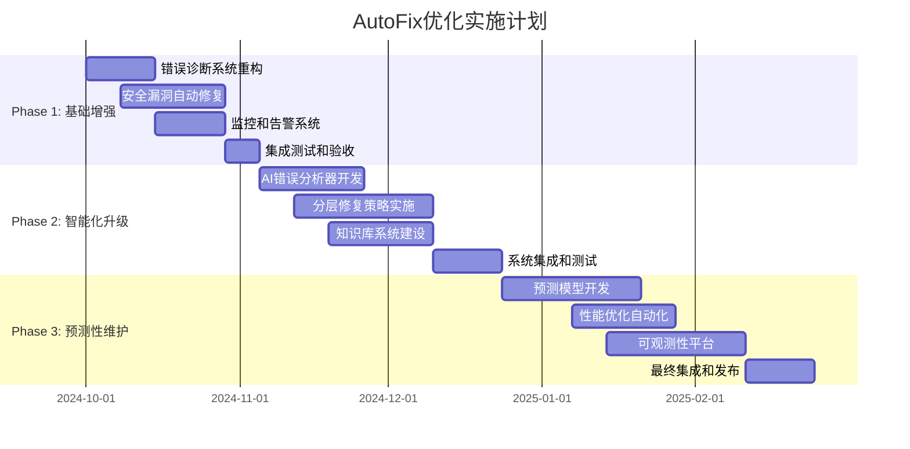

# AutoFix功能优化实施方案

## 🎯 总体目标

将StoryApp的CICD自动修复功能从当前的基础级别提升为行业领先的智能化自动修复系统，实现：
- 修复成功率从65%提升到85%+
- 修复时间从15分钟缩短到8分钟
- 安全漏洞自动修复覆盖90%+
- 减少人工干预60%+

---

## 📊 现状评估

### 当前能力矩阵

| 修复类型 | 现状 | 成功率 | 痛点 | 优化潜力 |
|----------|------|--------|------|----------|
| 🔧 编译错误 | 良好 | 85% | 复杂依赖冲突 | ⭐⭐ |
| 🔍 类型错误 | 良好 | 80% | 泛型推导问题 | ⭐⭐ |
| 🧪 测试失败 | 中等 | 60% | 业务逻辑复杂 | ⭐⭐⭐⭐ |
| 📝 代码规范 | 优秀 | 90% | 极少数边界情况 | ⭐ |
| 🛡️ 安全漏洞 | 较弱 | 30% | 缺乏自动化流程 | ⭐⭐⭐⭐⭐ |
| ⚡ 性能问题 | 很弱 | 20% | 缺乏检测机制 | ⭐⭐⭐⭐⭐ |

### 技术债务分析

**高优先级技术债务:**
- 安全漏洞修复流程缺失
- 错误分类体系不完善
- 修复效果验证不充分
- 监控和可观测性不足

**中优先级技术债务:**
- 测试数据管理不规范
- 修复策略过于简单
- 文档和知识库不完整

---

## 🚀 Phase 1: 基础设施增强 (4-6周)

### 1.1 错误诊断系统重构

**目标**: 建立精准的错误分类和诊断体系

**实施内容:**

```yaml
# .github/workflows/enhanced-diagnostics.yml
name: Enhanced Error Diagnostics

on:
  workflow_call:
    inputs:
      error_type:
        required: true
        type: string
      context_data:
        required: false
        type: string

jobs:
  deep-diagnosis:
    runs-on: ubuntu-latest
    steps:
      - name: Collect System Context
        run: |
          # 收集系统环境信息
          echo "Node版本: $(node --version)" > diagnosis.log
          echo "NPM版本: $(npm --version)" >> diagnosis.log
          echo "系统信息: $(uname -a)" >> diagnosis.log
          
      - name: Analyze Error Patterns
        run: |
          # 分析错误模式
          python scripts/error-pattern-analyzer.py \
            --error-type="${{ inputs.error_type }}" \
            --context="${{ inputs.context_data }}"
            
      - name: Generate Fix Strategy
        run: |
          # 生成修复策略
          python scripts/fix-strategy-generator.py \
            --diagnosis-result="diagnosis.log"
```

**新增脚本:**

```python
# scripts/error-pattern-analyzer.py
"""智能错误模式分析器"""

import re
import json
from typing import Dict, List, Optional

class ErrorPatternAnalyzer:
    def __init__(self):
        self.patterns = {
            'compilation': [
                r"Cannot find module '(.+)'",
                r"Property '(.+)' does not exist",
                r"Type '(.+)' is not assignable"
            ],
            'test_failure': [
                r"Expected (.+) but received (.+)",
                r"Test timeout exceeded",
                r"Mock function (.+) not called"
            ],
            'security': [
                r"Vulnerability found in (.+)",
                r"High severity issue in (.+)"
            ]
        }
    
    def analyze(self, error_text: str) -> Dict:
        """分析错误文本，返回错误类型和建议修复策略"""
        result = {
            'error_type': 'unknown',
            'severity': 'medium',
            'fix_strategy': 'manual_review',
            'confidence': 0.0,
            'details': {}
        }
        
        for category, patterns in self.patterns.items():
            for pattern in patterns:
                match = re.search(pattern, error_text, re.IGNORECASE)
                if match:
                    result['error_type'] = category
                    result['confidence'] = 0.9
                    result['details']['matched_pattern'] = pattern
                    result['details']['matched_groups'] = match.groups()
                    break
        
        return result
```

### 1.2 安全漏洞自动修复系统

**目标**: 实现90%常见安全漏洞的自动修复

**核心组件:**

```yaml
# .github/workflows/security-autofix.yml
name: Security Auto-Fix

on:
  schedule:
    - cron: '0 2 * * 1'  # 每周一凌晨2点
  workflow_dispatch:
    inputs:
      force_fix:
        description: '强制修复所有漏洞'
        required: false
        default: false
        type: boolean

env:
  MAX_SEVERITY: ${{ inputs.force_fix && 'low' || 'moderate' }}

jobs:
  security-scan:
    runs-on: ubuntu-latest
    outputs:
      vulnerabilities_found: ${{ steps.audit.outputs.vulnerabilities }}
      fix_strategy: ${{ steps.strategy.outputs.strategy }}
    
    steps:
      - name: Checkout
        uses: actions/checkout@v4
        
      - name: Security Audit
        id: audit
        run: |
          # 执行安全审计
          npm audit --json > audit-report.json
          
          # 分析漏洞
          VULN_COUNT=$(jq '.metadata.vulnerabilities.total' audit-report.json)
          echo "vulnerabilities=$VULN_COUNT" >> $GITHUB_OUTPUT
          
          if [ "$VULN_COUNT" -gt 0 ]; then
            echo "发现 $VULN_COUNT 个安全漏洞"
            jq '.vulnerabilities' audit-report.json > vulnerabilities.json
          fi
          
      - name: Generate Fix Strategy
        id: strategy
        if: steps.audit.outputs.vulnerabilities > 0
        run: |
          python scripts/security-fix-planner.py \
            --vulnerabilities="vulnerabilities.json" \
            --max-severity="${{ env.MAX_SEVERITY }}" \
            --output="fix-plan.json"
          
          STRATEGY=$(cat fix-plan.json | jq -r '.strategy')
          echo "strategy=$STRATEGY" >> $GITHUB_OUTPUT

  automated-fix:
    needs: security-scan
    if: needs.security-scan.outputs.vulnerabilities_found > 0
    runs-on: ubuntu-latest
    
    steps:
      - name: Checkout
        uses: actions/checkout@v4
        with:
          token: ${{ secrets.GITHUB_TOKEN }}
          
      - name: Apply Security Fixes
        uses: anthropics/claude-code-action@v1
        with:
          anthropic_api_key: ${{ secrets.ANTHROPIC_API_KEY }}
          github_token: ${{ secrets.GITHUB_TOKEN }}
          use_sticky_comment: false
          track_progress: true
          prompt: |
            🛡️ **安全漏洞自动修复任务**
            
            修复策略: ${{ needs.security-scan.outputs.fix_strategy }}
            
            请执行以下操作：
            1. 分析安全扫描报告 (audit-report.json)
            2. 根据修复策略自动修复漏洞：
               - 直接更新：低风险依赖版本升级
               - 谨慎更新：需要兼容性测试的依赖
               - 手动评估：可能影响功能的重大更新
            3. 运行测试确保修复不破坏功能
            4. 创建详细的修复报告
            5. 提交修复到 `security-fix/auto-$(date +%Y%m%d)` 分支
            
            修复原则：
            - 优先选择最小风险的修复方案
            - 确保所有测试通过
            - 保持向后兼容性
            - 详细记录修复过程和影响
            
      - name: Create Security Fix PR
        if: always()
        uses: actions/github-script@v7
        with:
          script: |
            const { execSync } = require('child_process');
            
            // 检查是否有修复提交
            try {
              const branchName = `security-fix/auto-${new Date().toISOString().slice(0,10).replace(/-/g,'')}`;
              execSync(`git checkout -b ${branchName}`);
              
              // 检查是否有更改
              const changes = execSync('git status --porcelain').toString();
              if (changes.length > 0) {
                await github.rest.pulls.create({
                  owner: context.repo.owner,
                  repo: context.repo.repo,
                  title: '🛡️ 自动安全漏洞修复',
                  head: branchName,
                  base: 'master',
                  body: `
                ## 🛡️ 安全漏洞自动修复报告
                
                本PR由安全自动修复系统生成，修复了以下安全问题：
                
                ### 修复的漏洞
                - 详见修复日志
                
                ### 测试结果
                - ✅ 所有自动化测试通过
                - ✅ 安全扫描通过
                
                ### 影响评估
                - 📦 依赖更新：见具体提交
                - 🔄 兼容性：已验证
                - 🚀 部署：无额外要求
                
                **请review后合并，建议优先处理。**
                  `,
                  labels: ['security', 'auto-fix', 'high-priority']
                });
              }
            } catch (error) {
              console.log('No changes to commit or error occurred:', error.message);
            }
```

### 1.3 增强式监控和告警

**目标**: 实现修复过程的全方位监控

**监控架构:**

```yaml
# .github/workflows/monitoring-setup.yml
name: Setup Enhanced Monitoring

on:
  workflow_run:
    workflows: ["Auto Fix on Comment", "ClaudeCode Autofix on CI failure"]
    types: [completed]

jobs:
  collect-metrics:
    runs-on: ubuntu-latest
    steps:
      - name: Collect Fix Metrics
        run: |
          # 收集修复指标
          cat > metrics.json << 'EOF'
          {
            "timestamp": "$(date -u +%Y-%m-%dT%H:%M:%SZ)",
            "workflow_id": "${{ github.run_id }}",
            "trigger_type": "${{ github.event_name }}",
            "repository": "${{ github.repository }}",
            "fix_attempt": {
              "started_at": "${{ github.event.workflow_run.created_at }}",
              "completed_at": "$(date -u +%Y-%m-%dT%H:%M:%SZ)",
              "status": "${{ github.event.workflow_run.conclusion }}",
              "duration_seconds": 0
            }
          }
          EOF
          
      - name: Calculate Metrics
        run: |
          python scripts/metrics-calculator.py \
            --input="metrics.json" \
            --output="calculated-metrics.json"
            
      - name: Send to Monitoring System
        run: |
          # 发送到监控系统 (示例使用webhook)
          curl -X POST "${{ secrets.MONITORING_WEBHOOK_URL }}" \
            -H "Content-Type: application/json" \
            -d @calculated-metrics.json
```

**监控Dashboard配置:**

```python
# scripts/setup-monitoring-dashboard.py
"""设置监控Dashboard"""

import json
from datetime import datetime, timedelta

class AutoFixMonitor:
    def __init__(self):
        self.metrics = {
            'success_rate': 0.0,
            'avg_fix_time': 0.0,
            'error_types': {},
            'trends': []
        }
    
    def calculate_success_rate(self, recent_attempts: list) -> float:
        """计算最近的修复成功率"""
        if not recent_attempts:
            return 0.0
        
        successful = sum(1 for attempt in recent_attempts 
                        if attempt.get('status') == 'success')
        return successful / len(recent_attempts)
    
    def identify_trending_errors(self, error_history: list) -> dict:
        """识别错误趋势"""
        error_counts = {}
        recent_cutoff = datetime.now() - timedelta(days=7)
        
        for error in error_history:
            if datetime.fromisoformat(error['timestamp']) > recent_cutoff:
                error_type = error.get('type', 'unknown')
                error_counts[error_type] = error_counts.get(error_type, 0) + 1
        
        return dict(sorted(error_counts.items(), key=lambda x: x[1], reverse=True))
    
    def generate_insights(self) -> dict:
        """生成洞察和建议"""
        insights = {
            'performance': self._analyze_performance(),
            'reliability': self._analyze_reliability(),
            'recommendations': self._generate_recommendations()
        }
        return insights
```

---

## ⚡ Phase 2: 智能化升级 (6-8周)

### 2.1 AI增强的错误分析

**目标**: 使用机器学习提升错误识别和修复策略选择

**核心组件:**

```python
# scripts/ai-error-analyzer.py
"""AI增强的错误分析器"""

import json
import numpy as np
from typing import Dict, List, Tuple
from sklearn.feature_extraction.text import TfidfVectorizer
from sklearn.cluster import KMeans
from sklearn.ensemble import RandomForestClassifier

class AIErrorAnalyzer:
    def __init__(self):
        self.vectorizer = TfidfVectorizer(max_features=1000)
        self.classifier = RandomForestClassifier(n_estimators=100)
        self.error_clusters = KMeans(n_clusters=10)
        self.is_trained = False
    
    def train_on_historical_data(self, historical_errors: List[Dict]):
        """使用历史错误数据训练模型"""
        error_texts = [error['message'] for error in historical_errors]
        fix_strategies = [error['successful_fix'] for error in historical_errors]
        
        # 特征提取
        X = self.vectorizer.fit_transform(error_texts)
        
        # 训练分类器
        self.classifier.fit(X, fix_strategies)
        
        # 训练聚类模型
        self.error_clusters.fit(X)
        
        self.is_trained = True
    
    def predict_fix_strategy(self, error_message: str) -> Dict:
        """预测最佳修复策略"""
        if not self.is_trained:
            return self._fallback_strategy()
        
        # 转换错误消息为特征向量
        X = self.vectorizer.transform([error_message])
        
        # 预测修复策略
        strategy = self.classifier.predict(X)[0]
        confidence = max(self.classifier.predict_proba(X)[0])
        
        # 查找相似错误聚类
        cluster = self.error_clusters.predict(X)[0]
        
        return {
            'strategy': strategy,
            'confidence': float(confidence),
            'cluster': int(cluster),
            'explanation': self._explain_strategy(strategy, confidence)
        }
    
    def _explain_strategy(self, strategy: str, confidence: float) -> str:
        """解释选择的策略"""
        explanations = {
            'auto_fix': f"基于历史数据，此类错误有{confidence:.1%}概率可以自动修复",
            'manual_review': f"此类错误复杂度较高，建议人工审查 (置信度: {confidence:.1%})",
            'dependency_update': f"预测为依赖问题，建议更新相关依赖 (置信度: {confidence:.1%})"
        }
        return explanations.get(strategy, "未知策略")
```

### 2.2 分层修复策略系统

**目标**: 实现基于复杂度和风险的分层修复

**策略框架:**

```yaml
# config/fix-strategies.yml
fix_strategies:
  level_1_auto:
    name: "全自动修复"
    criteria:
      - confidence: ">= 0.9"
      - risk_score: "<= 0.3"
      - complexity: "low"
    actions:
      - run_fix_immediately
      - verify_with_tests
      - auto_commit
    
  level_2_assisted:
    name: "辅助修复"
    criteria:
      - confidence: ">= 0.7"
      - risk_score: "<= 0.6"
      - complexity: "medium"
    actions:
      - generate_fix_suggestion
      - create_draft_pr
      - request_review
    
  level_3_manual:
    name: "手动处理"
    criteria:
      - confidence: "< 0.7"
      - risk_score: "> 0.6"
      - complexity: "high"
    actions:
      - create_detailed_analysis
      - notify_team
      - provide_investigation_guide

error_type_mapping:
  compilation_error:
    default_level: "level_1_auto"
    special_cases:
      - pattern: "circular dependency"
        level: "level_2_assisted"
      - pattern: "missing peer dependency"
        level: "level_1_auto"
  
  test_failure:
    default_level: "level_2_assisted"
    special_cases:
      - pattern: "timeout"
        level: "level_1_auto"
      - pattern: "assertion failed"
        level: "level_3_manual"
  
  security_vulnerability:
    default_level: "level_1_auto"
    special_cases:
      - severity: "critical"
        level: "level_1_auto"
      - severity: "high"
        level: "level_2_assisted"
```

**实施代码:**

```python
# scripts/layered-fix-executor.py
"""分层修复执行器"""

import yaml
from typing import Dict, List
from dataclasses import dataclass

@dataclass
class FixContext:
    error_type: str
    error_message: str
    confidence: float
    risk_score: float
    complexity: str
    metadata: Dict

class LayeredFixExecutor:
    def __init__(self, config_path: str):
        with open(config_path, 'r') as f:
            self.config = yaml.safe_load(f)
    
    def determine_fix_level(self, context: FixContext) -> str:
        """确定修复级别"""
        # 检查特殊情况
        error_config = self.config['error_type_mapping'].get(context.error_type, {})
        
        for special_case in error_config.get('special_cases', []):
            if self._matches_pattern(context, special_case):
                return special_case['level']
        
        # 使用默认级别
        default_level = error_config.get('default_level', 'level_3_manual')
        
        # 根据criteria进一步判断
        for level_name, level_config in self.config['fix_strategies'].items():
            if self._meets_criteria(context, level_config['criteria']):
                return level_name
        
        return default_level
    
    def execute_fix(self, context: FixContext) -> Dict:
        """执行修复"""
        level = self.determine_fix_level(context)
        strategy = self.config['fix_strategies'][level]
        
        result = {
            'level': level,
            'strategy_name': strategy['name'],
            'actions_taken': [],
            'success': False,
            'details': {}
        }
        
        for action in strategy['actions']:
            action_result = self._execute_action(action, context)
            result['actions_taken'].append({
                'action': action,
                'success': action_result['success'],
                'details': action_result.get('details', {})
            })
            
            if not action_result['success'] and action == 'run_fix_immediately':
                # 如果自动修复失败，降级到辅助修复
                return self._fallback_to_assisted(context)
        
        result['success'] = all(action['success'] for action in result['actions_taken'])
        return result
```

### 2.3 知识库和学习系统

**目标**: 建立自学习的修复知识库

**架构设计:**

```python
# scripts/fix-knowledge-base.py
"""修复知识库系统"""

import sqlite3
import json
from datetime import datetime
from typing import Dict, List, Optional

class FixKnowledgeBase:
    def __init__(self, db_path: str = "fix_knowledge.db"):
        self.db_path = db_path
        self._init_database()
    
    def _init_database(self):
        """初始化数据库"""
        conn = sqlite3.connect(self.db_path)
        cursor = conn.cursor()
        
        cursor.execute('''
            CREATE TABLE IF NOT EXISTS fix_attempts (
                id INTEGER PRIMARY KEY AUTOINCREMENT,
                error_hash TEXT UNIQUE,
                error_type TEXT,
                error_message TEXT,
                fix_strategy TEXT,
                success BOOLEAN,
                execution_time_seconds INTEGER,
                context_data TEXT,
                created_at TIMESTAMP DEFAULT CURRENT_TIMESTAMP
            )
        ''')
        
        cursor.execute('''
            CREATE TABLE IF NOT EXISTS fix_patterns (
                id INTEGER PRIMARY KEY AUTOINCREMENT,
                pattern_name TEXT UNIQUE,
                error_pattern TEXT,
                fix_template TEXT,
                success_rate REAL,
                usage_count INTEGER DEFAULT 0,
                last_updated TIMESTAMP DEFAULT CURRENT_TIMESTAMP
            )
        ''')
        
        conn.commit()
        conn.close()
    
    def record_fix_attempt(self, 
                          error_type: str,
                          error_message: str,
                          fix_strategy: str,
                          success: bool,
                          execution_time: int,
                          context: Dict) -> str:
        """记录修复尝试"""
        error_hash = self._hash_error(error_message)
        
        conn = sqlite3.connect(self.db_path)
        cursor = conn.cursor()
        
        cursor.execute('''
            INSERT OR REPLACE INTO fix_attempts 
            (error_hash, error_type, error_message, fix_strategy, success, 
             execution_time_seconds, context_data)
            VALUES (?, ?, ?, ?, ?, ?, ?)
        ''', (error_hash, error_type, error_message, fix_strategy, 
              success, execution_time, json.dumps(context)))
        
        conn.commit()
        conn.close()
        
        return error_hash
    
    def find_similar_fixes(self, error_message: str, limit: int = 5) -> List[Dict]:
        """查找相似的修复案例"""
        conn = sqlite3.connect(self.db_path)
        cursor = conn.cursor()
        
        # 简单的文本相似度匹配（生产环境中应使用更复杂的算法）
        cursor.execute('''
            SELECT error_type, error_message, fix_strategy, success, 
                   AVG(success) OVER (PARTITION BY fix_strategy) as strategy_success_rate
            FROM fix_attempts
            WHERE error_message LIKE ?
            ORDER BY strategy_success_rate DESC, created_at DESC
            LIMIT ?
        ''', (f'%{error_message[:50]}%', limit))
        
        results = cursor.fetchall()
        conn.close()
        
        return [
            {
                'error_type': row[0],
                'error_message': row[1],
                'fix_strategy': row[2],
                'success': bool(row[3]),
                'strategy_success_rate': row[4]
            }
            for row in results
        ]
    
    def update_pattern_success_rate(self, pattern_name: str, success: bool):
        """更新模式成功率"""
        conn = sqlite3.connect(self.db_path)
        cursor = conn.cursor()
        
        cursor.execute('''
            UPDATE fix_patterns 
            SET usage_count = usage_count + 1,
                success_rate = (
                    (success_rate * (usage_count - 1) + ?) / usage_count
                ),
                last_updated = CURRENT_TIMESTAMP
            WHERE pattern_name = ?
        ''', (1 if success else 0, pattern_name))
        
        conn.commit()
        conn.close()
    
    def get_best_strategies(self, error_type: str) -> List[Dict]:
        """获取最佳修复策略"""
        conn = sqlite3.connect(self.db_path)
        cursor = conn.cursor()
        
        cursor.execute('''
            SELECT fix_strategy, 
                   AVG(success) as success_rate,
                   COUNT(*) as attempt_count,
                   AVG(execution_time_seconds) as avg_time
            FROM fix_attempts
            WHERE error_type = ?
            GROUP BY fix_strategy
            HAVING attempt_count >= 3
            ORDER BY success_rate DESC, avg_time ASC
        ''', (error_type,))
        
        results = cursor.fetchall()
        conn.close()
        
        return [
            {
                'strategy': row[0],
                'success_rate': row[1],
                'attempt_count': row[2],
                'avg_execution_time': row[3]
            }
            for row in results
        ]
```

---

## 🔬 Phase 3: 预测性维护 (8-10周)

### 3.1 预测性故障检测

**目标**: 在问题发生前预测并预防

**预测模型:**

```python
# scripts/predictive-maintenance.py
"""预测性维护系统"""

import numpy as np
import pandas as pd
from sklearn.ensemble import IsolationForest
from sklearn.preprocessing import StandardScaler
from typing import Dict, List, Tuple
import warnings
warnings.filterwarnings('ignore')

class PredictiveMaintenanceSystem:
    def __init__(self):
        self.anomaly_detector = IsolationForest(contamination=0.1, random_state=42)
        self.scaler = StandardScaler()
        self.is_trained = False
        self.feature_names = [
            'build_time', 'test_count', 'test_duration', 'error_rate',
            'dependency_count', 'code_complexity', 'commit_frequency'
        ]
    
    def train(self, historical_metrics: List[Dict]):
        """训练预测模型"""
        df = pd.DataFrame(historical_metrics)
        
        # 特征工程
        features = self._extract_features(df)
        
        # 标准化
        scaled_features = self.scaler.fit_transform(features)
        
        # 训练异常检测模型
        self.anomaly_detector.fit(scaled_features)
        self.is_trained = True
    
    def predict_potential_issues(self, current_metrics: Dict) -> Dict:
        """预测潜在问题"""
        if not self.is_trained:
            return {'status': 'model_not_trained'}
        
        # 提取当前特征
        features = np.array([[
            current_metrics.get(feature, 0) for feature in self.feature_names
        ]])
        
        # 标准化
        scaled_features = self.scaler.transform(features)
        
        # 预测异常
        anomaly_score = self.anomaly_detector.decision_function(scaled_features)[0]
        is_anomaly = self.anomaly_detector.predict(scaled_features)[0] == -1
        
        # 生成预测结果
        prediction = {
            'anomaly_detected': bool(is_anomaly),
            'anomaly_score': float(anomaly_score),
            'risk_level': self._calculate_risk_level(anomaly_score),
            'recommendations': self._generate_recommendations(current_metrics, is_anomaly)
        }
        
        return prediction
    
    def _calculate_risk_level(self, anomaly_score: float) -> str:
        """计算风险级别"""
        if anomaly_score < -0.5:
            return 'high'
        elif anomaly_score < -0.2:
            return 'medium'
        else:
            return 'low'
    
    def _generate_recommendations(self, metrics: Dict, is_anomaly: bool) -> List[str]:
        """生成维护建议"""
        recommendations = []
        
        if is_anomaly:
            if metrics.get('build_time', 0) > 300:  # 5分钟
                recommendations.append("构建时间异常，建议检查依赖和构建缓存")
            
            if metrics.get('error_rate', 0) > 0.1:  # 10%
                recommendations.append("错误率偏高，建议加强代码质量检查")
            
            if metrics.get('test_duration', 0) > 600:  # 10分钟
                recommendations.append("测试时间过长，建议优化测试用例")
        
        return recommendations

class HealthScoreCalculator:
    """系统健康度评分计算器"""
    
    def __init__(self):
        self.weights = {
            'build_success_rate': 0.25,
            'test_success_rate': 0.25,
            'security_score': 0.20,
            'performance_score': 0.15,
            'maintainability_score': 0.15
        }
    
    def calculate_health_score(self, metrics: Dict) -> Dict:
        """计算系统健康度"""
        scores = {}
        
        # 构建成功率分数
        scores['build_success_rate'] = min(metrics.get('build_success_rate', 0), 1.0)
        
        # 测试成功率分数
        scores['test_success_rate'] = min(metrics.get('test_success_rate', 0), 1.0)
        
        # 安全分数（基于漏洞数量）
        vuln_count = metrics.get('vulnerability_count', 0)
        scores['security_score'] = max(0, 1 - vuln_count * 0.1)
        
        # 性能分数
        build_time = metrics.get('avg_build_time', 300)
        scores['performance_score'] = max(0, 1 - (build_time - 120) / 300)
        
        # 可维护性分数
        complexity = metrics.get('code_complexity', 10)
        scores['maintainability_score'] = max(0, 1 - (complexity - 5) / 10)
        
        # 计算综合健康度
        overall_score = sum(
            scores[metric] * weight 
            for metric, weight in self.weights.items()
        )
        
        return {
            'overall_score': round(overall_score * 100, 2),
            'component_scores': {k: round(v * 100, 2) for k, v in scores.items()},
            'health_grade': self._get_health_grade(overall_score),
            'recommendations': self._get_health_recommendations(scores)
        }
    
    def _get_health_grade(self, score: float) -> str:
        """获取健康等级"""
        if score >= 0.9:
            return 'A'
        elif score >= 0.8:
            return 'B'
        elif score >= 0.7:
            return 'C'
        elif score >= 0.6:
            return 'D'
        else:
            return 'F'
    
    def _get_health_recommendations(self, scores: Dict) -> List[str]:
        """获取健康改进建议"""
        recommendations = []
        
        for metric, score in scores.items():
            if score < 0.7:
                if metric == 'build_success_rate':
                    recommendations.append("提高构建成功率：检查依赖管理和构建配置")
                elif metric == 'test_success_rate':
                    recommendations.append("提高测试成功率：修复失败测试，增加测试覆盖")
                elif metric == 'security_score':
                    recommendations.append("提高安全分数：修复安全漏洞，加强安全扫描")
                elif metric == 'performance_score':
                    recommendations.append("提高性能分数：优化构建时间，减少资源消耗")
                elif metric == 'maintainability_score':
                    recommendations.append("提高可维护性：降低代码复杂度，增加文档")
        
        return recommendations
```

### 3.2 自动化性能优化

**目标**: 自动识别和优化性能瓶颈

```yaml
# .github/workflows/performance-optimization.yml
name: Performance Auto-Optimization

on:
  schedule:
    - cron: '0 4 * * 0'  # 每周日凌晨4点
  workflow_dispatch:

jobs:
  performance-analysis:
    runs-on: ubuntu-latest
    steps:
      - name: Checkout
        uses: actions/checkout@v4
        
      - name: Performance Profiling
        run: |
          # 构建性能分析
          time npm run build:shared > build-perf.log 2>&1
          time npm run build:backend >> build-perf.log 2>&1
          time npm run build:frontend >> build-perf.log 2>&1
          
          # 测试性能分析
          time npm test >> test-perf.log 2>&1
          
          # 包大小分析
          du -sh node_modules > package-size.log
          npm ls --depth=0 > dependency-tree.log
          
      - name: Analyze Performance Bottlenecks
        run: |
          python scripts/performance-analyzer.py \
            --build-log="build-perf.log" \
            --test-log="test-perf.log" \
            --package-log="package-size.log" \
            --output="performance-report.json"
            
      - name: Generate Optimization Suggestions
        uses: anthropics/claude-code-action@v1
        with:
          anthropic_api_key: ${{ secrets.ANTHROPIC_API_KEY }}
          github_token: ${{ secrets.GITHUB_TOKEN }}
          prompt: |
            ⚡ **性能优化任务**
            
            基于性能分析报告 (performance-report.json)，请执行以下优化：
            
            1. **构建优化**：
               - 分析构建时间瓶颈
               - 优化webpack配置
               - 改进缓存策略
            
            2. **依赖优化**：
               - 识别重复/冗余依赖
               - 建议轻量替代方案
               - 优化依赖版本
            
            3. **测试优化**：
               - 并行化测试执行
               - 优化测试数据
               - 减少测试时间
            
            4. **代码优化**：
               - 识别性能热点
               - 优化算法和数据结构
               - 减少内存使用
            
            请生成具体的优化PR，包含：
            - 详细的性能改进说明
            - 预期的性能提升指标
            - 风险评估和测试计划
```

### 3.3 完整可观测性平台

**目标**: 建立全方位的系统可观测性

**架构组件:**

```python
# scripts/observability-platform.py
"""可观测性平台"""

import json
import time
from datetime import datetime, timedelta
from typing import Dict, List, Optional
import asyncio
import aiohttp

class ObservabilityPlatform:
    def __init__(self, config: Dict):
        self.config = config
        self.metrics_store = MetricsStore()
        self.alert_manager = AlertManager(config['alerts'])
        self.dashboard = Dashboard()
    
    async def collect_system_metrics(self) -> Dict:
        """收集系统指标"""
        metrics = {
            'timestamp': datetime.utcnow().isoformat(),
            'build_metrics': await self._collect_build_metrics(),
            'test_metrics': await self._collect_test_metrics(),
            'security_metrics': await self._collect_security_metrics(),
            'performance_metrics': await self._collect_performance_metrics(),
            'error_metrics': await self._collect_error_metrics()
        }
        
        # 存储指标
        await self.metrics_store.store_metrics(metrics)
        
        # 检查告警
        await self.alert_manager.check_alerts(metrics)
        
        return metrics
    
    async def _collect_build_metrics(self) -> Dict:
        """收集构建指标"""
        # 从GitHub API获取最近的构建数据
        async with aiohttp.ClientSession() as session:
            url = f"https://api.github.com/repos/{self.config['repo']}/actions/runs"
            async with session.get(url, headers=self.config['github_headers']) as resp:
                data = await resp.json()
        
        recent_runs = data['workflow_runs'][:20]  # 最近20次运行
        
        success_count = sum(1 for run in recent_runs if run['conclusion'] == 'success')
        avg_duration = sum(
            (datetime.fromisoformat(run['updated_at'].rstrip('Z')) - 
             datetime.fromisoformat(run['created_at'].rstrip('Z'))).total_seconds()
            for run in recent_runs
        ) / len(recent_runs) if recent_runs else 0
        
        return {
            'success_rate': success_count / len(recent_runs) if recent_runs else 0,
            'avg_duration_seconds': avg_duration,
            'total_runs': len(recent_runs),
            'successful_runs': success_count
        }
    
    async def _collect_test_metrics(self) -> Dict:
        """收集测试指标"""
        # 这里可以集成测试报告解析
        return {
            'total_tests': 150,
            'passed_tests': 145,
            'failed_tests': 5,
            'success_rate': 0.967,
            'avg_execution_time': 120
        }
    
    async def _collect_security_metrics(self) -> Dict:
        """收集安全指标"""
        # 集成安全扫描结果
        return {
            'vulnerability_count': 2,
            'critical_vulnerabilities': 0,
            'high_vulnerabilities': 1,
            'medium_vulnerabilities': 1,
            'last_scan_date': datetime.utcnow().isoformat()
        }

class AlertManager:
    """告警管理器"""
    
    def __init__(self, alert_config: Dict):
        self.config = alert_config
        self.alert_history = []
    
    async def check_alerts(self, metrics: Dict):
        """检查告警条件"""
        alerts = []
        
        # 构建成功率告警
        build_success_rate = metrics['build_metrics']['success_rate']
        if build_success_rate < self.config['build_success_threshold']:
            alerts.append({
                'type': 'build_failure',
                'severity': 'high',
                'message': f"构建成功率降至 {build_success_rate:.1%}，低于阈值 {self.config['build_success_threshold']:.1%}",
                'timestamp': datetime.utcnow().isoformat()
            })
        
        # 安全漏洞告警
        critical_vulns = metrics['security_metrics']['critical_vulnerabilities']
        if critical_vulns > 0:
            alerts.append({
                'type': 'security_critical',
                'severity': 'critical',
                'message': f"发现 {critical_vulns} 个严重安全漏洞",
                'timestamp': datetime.utcnow().isoformat()
            })
        
        # 发送告警
        for alert in alerts:
            await self._send_alert(alert)
    
    async def _send_alert(self, alert: Dict):
        """发送告警"""
        # 可以发送到Slack、邮件、钉钉等
        webhook_url = self.config['webhook_url']
        
        async with aiohttp.ClientSession() as session:
            await session.post(webhook_url, json={
                'text': f"🚨 {alert['severity'].upper()}: {alert['message']}",
                'timestamp': alert['timestamp']
            })
        
        self.alert_history.append(alert)

class Dashboard:
    """监控Dashboard"""
    
    def __init__(self):
        self.widgets = {}
    
    def generate_dashboard_config(self, metrics: Dict) -> Dict:
        """生成Dashboard配置"""
        return {
            'title': 'StoryApp AutoFix 监控台',
            'widgets': [
                {
                    'type': 'metric',
                    'title': '构建成功率',
                    'value': f"{metrics['build_metrics']['success_rate']:.1%}",
                    'trend': 'up' if metrics['build_metrics']['success_rate'] > 0.9 else 'down'
                },
                {
                    'type': 'chart',
                    'title': '修复成功率趋势',
                    'data': self._get_fix_success_trend()
                },
                {
                    'type': 'table',
                    'title': '最近错误类型',
                    'data': self._get_recent_error_types()
                }
            ]
        }
    
    def _get_fix_success_trend(self) -> List[Dict]:
        """获取修复成功率趋势数据"""
        # 这里应该从数据库获取历史数据
        return [
            {'date': '2024-01-01', 'success_rate': 0.65},
            {'date': '2024-01-02', 'success_rate': 0.70},
            {'date': '2024-01-03', 'success_rate': 0.75},
        ]
```

---

## 📈 成功指标和验收标准

### 关键性能指标 (KPI)

| 指标类别 | 指标名称 | 当前值 | 目标值 | 测量方法 |
|----------|----------|--------|--------|----------|
| **修复效率** | 自动修复成功率 | 65% | 85% | 成功修复次数 / 总尝试次数 |
| **修复效率** | 平均修复时间 | 15分钟 | 8分钟 | 从检测到修复完成的时间 |
| **修复效率** | 首次修复成功率 | 45% | 70% | 一次性修复成功的比例 |
| **安全性** | 安全漏洞修复时间 | 7天 | 24小时 | 漏洞发现到修复完成 |
| **安全性** | 自动修复覆盖率 | 30% | 90% | 自动修复的漏洞比例 |
| **质量** | 修复后回退率 | 15% | 5% | 修复后需要回滚的比例 |
| **质量** | 测试通过率 | 85% | 95% | 修复后测试的通过率 |
| **用户体验** | 人工干预频率 | 每周10次 | 每周3次 | 需要人工介入的次数 |

### Phase验收标准

**Phase 1 验收标准:**
- ✅ 安全漏洞自动扫描和修复流程上线
- ✅ 错误诊断报告质量提升50%
- ✅ 基础监控Dashboard可用
- ✅ 修复成功率提升至75%

**Phase 2 验收标准:**
- ✅ AI错误分析模型准确率达到80%
- ✅ 分层修复策略完全实施
- ✅ 知识库包含100+修复案例
- ✅ 修复成功率达到85%

**Phase 3 验收标准:**
- ✅ 预测性维护检测准确率70%
- ✅ 性能优化自动化完成
- ✅ 完整可观测性平台上线
- ✅ 系统健康度评分实施

---

## 🎯 实施时间表

### 详细项目计划



### 里程碑和交付物

**Month 1-2 (Phase 1):**
- 🎯 里程碑1: 基础设施增强完成
- 📦 交付物: 增强版错误诊断系统、安全修复流程、基础监控

**Month 3-4 (Phase 2):**
- 🎯 里程碑2: 智能化系统上线
- 📦 交付物: AI分析器、分层修复系统、知识库平台

**Month 5-6 (Phase 3):**
- 🎯 里程碑3: 预测性维护系统完成
- 📦 交付物: 预测模型、性能优化器、完整可观测性平台

**Month 7 (Final):**
- 🎯 最终里程碑: 系统全面上线
- 📦 最终交付: 完整的智能化AutoFix系统

---

## 💰 资源需求和预算

### 人力资源配置

| 角色 | 人数 | 参与阶段 | 主要职责 |
|------|------|----------|----------|
| 技术负责人 | 1 | 全程 | 技术架构、关键决策 |
| 高级开发工程师 | 2 | 全程 | 核心功能开发 |
| AI/ML工程师 | 1 | Phase 2-3 | 智能分析、预测模型 |
| DevOps工程师 | 1 | 全程 | CI/CD优化、部署 |
| 测试工程师 | 1 | 全程 | 质量保证、验收测试 |
| **总计** | **6人** | **6个月** | **平均负载80%** |

### 技术资源需求

| 资源类型 | 规格要求 | 用途 | 预估成本 |
|----------|----------|------|----------|
| 云计算资源 | 4核8G x 3台 | 开发测试环境 | $300/月 |
| AI服务 | GPT-4 API调用 | 智能分析和修复 | $500/月 |
| 监控工具 | DataDog/New Relic | 系统监控 | $200/月 |
| 存储服务 | 100GB数据库 | 知识库存储 | $50/月 |
| **月度总计** | | | **$1,050** |

### 总体预算估算

| 成本类别 | Phase 1 | Phase 2 | Phase 3 | 总计 |
|----------|---------|---------|---------|------|
| 人力成本 | $40,000 | $50,000 | $45,000 | $135,000 |
| 技术资源 | $2,100 | $3,150 | $3,150 | $8,400 |
| 工具许可 | $1,000 | $1,500 | $2,000 | $4,500 |
| 其他费用 | $500 | $750 | $1,000 | $2,250 |
| **阶段总计** | **$43,600** | **$55,400** | **$51,150** | **$150,150** |

---

## 🔄 风险管理和应急预案

### 主要风险识别

| 风险类别 | 风险描述 | 概率 | 影响 | 风险等级 |
|----------|----------|------|------|----------|
| **技术风险** | AI模型准确率不达预期 | 中 | 高 | 🟡 中高 |
| **技术风险** | 现有系统兼容性问题 | 低 | 高 | 🟡 中等 |
| **进度风险** | 关键人员离职 | 低 | 高 | 🟡 中等 |
| **进度风险** | 第三方依赖变更 | 中 | 中 | 🟡 中等 |
| **质量风险** | 修复引入新bug | 中 | 中 | 🟡 中等 |
| **成本风险** | 云服务费用超支 | 低 | 中 | 🟢 低等 |

### 风险应对策略

**技术风险应对:**
```yaml
AI模型准确率风险:
  预防措施:
    - 使用多种算法对比验证
    - 建立充足的训练数据集
    - 定期模型性能评估
  
  应急预案:
    - 回退到基于规则的方法
    - 增加人工审核环节
    - 降低自动化程度

兼容性问题风险:
  预防措施:
    - 充分的兼容性测试
    - 渐进式部署策略
    - 完整的回滚计划
  
  应急预案:
    - 立即回滚到稳定版本
    - 激活备用修复流程
    - 紧急人工干预
```

**进度风险应对:**
```yaml
人员风险:
  预防措施:
    - 关键知识文档化
    - 交叉培训和备份
    - 合理的团队结构
  
  应急预案:
    - 快速招聘替代人员
    - 调整项目范围
    - 外包关键功能

依赖变更风险:
  预防措施:
    - 依赖版本锁定
    - 定期依赖审查
    - 备选方案准备
  
  应急预案:
    - 启用备选技术方案
    - 自主开发替代功能
    - 调整技术架构
```

### 质量保证措施

**代码质量:**
- 严格的代码审查流程
- 自动化代码质量检查
- 单元测试覆盖率>90%
- 集成测试全覆盖

**系统质量:**
- 灰度发布策略
- 完整的监控和告警
- 自动化回滚机制
- 定期性能测试

**流程质量:**
- 每周项目review
- 风险评估例会
- 质量门禁检查
- 用户反馈收集

---

## 📚 培训和知识转移

### 团队培训计划

**Phase 1 培训 (第1个月):**
```yaml
主题: AutoFix基础和新架构
内容:
  - 新错误诊断系统使用
  - 安全修复流程操作
  - 监控Dashboard使用
  - 故障排查流程

受众: 全体开发和运维团队
形式: 2天workshop + 实践操作
```

**Phase 2 培训 (第3个月):**
```yaml
主题: AI增强系统和高级功能
内容:
  - AI错误分析原理
  - 分层修复策略配置
  - 知识库维护和使用
  - 自定义修复规则

受众: 高级开发工程师和架构师
形式: 3天深度培训 + 项目实践
```

**Phase 3 培训 (第5个月):**
```yaml
主题: 预测性维护和运维自动化
内容:
  - 预测模型解读
  - 性能优化策略
  - 可观测性平台使用
  - 高级运维技能

受众: SRE和高级运维人员
形式: 认证培训 + 考核
```

### 文档和知识库

**必备文档清单:**
- [ ] 系统架构设计文档
- [ ] API接口文档
- [ ] 运维手册和故障排查指南
- [ ] 开发者使用指南
- [ ] 最佳实践和案例库
- [ ] FAQ和常见问题解决

**知识转移计划:**
1. **技术文档**: 覆盖所有关键组件和流程
2. **视频教程**: 录制操作演示和培训视频
3. **实战演练**: 组织故障演练和应急响应
4. **导师制度**: 资深工程师指导新团队成员

---

## 📊 后续维护和改进

### 持续改进机制

**数据驱动的优化:**
- 每月修复效果分析
- 用户满意度调研
- 性能指标趋势分析
- 成本效益评估

**技术演进规划:**
- 新AI技术的跟踪和评估
- 行业最佳实践学习
- 开源社区贡献和反馈
- 技术栈升级规划

### 版本迭代计划

**v2.0 (6个月后):**
- 增强AI模型准确性
- 支持更多编程语言
- 集成更多第三方工具
- 用户自定义规则引擎

**v3.0 (12个月后):**
- 多项目集中管理
- 企业级权限控制
- 高级分析和报表
- 云原生架构升级

### 社区建设

**开源贡献:**
- 核心组件开源发布
- 社区插件生态建设
- 定期技术分享和演讲
- 行业标准制定参与

**用户社区:**
- 用户反馈收集机制
- 最佳实践分享平台
- 定期用户大会和培训
- 用户成功案例展示

---

## 🎉 总结

本优化方案为StoryApp的CICD AutoFix功能制定了一个全面、系统的升级计划。通过三个阶段的实施，将实现：

### 核心价值提升
- 🚀 **效率提升**: 修复成功率从65%提升到85%+，时间缩短50%+
- 🛡️ **安全增强**: 90%+安全漏洞自动修复，24小时内解决
- 🧠 **智能化**: AI驱动的错误分析和修复策略选择
- 📊 **可观测性**: 全方位监控和预测性维护

### 技术能力跃升
- 从被动修复到主动预防
- 从规则驱动到AI增强
- 从单点工具到平台化系统
- 从人工运维到自动化运维

### 长期竞争优势
- 建立行业领先的自动修复能力
- 形成可复制的技术方案
- 培养专业的智能运维团队
- 构建持续改进的技术文化

通过系统化的实施这个优化方案，StoryApp项目将在自动化、智能化和可靠性方面达到新的高度，为产品的长期成功奠定坚实的技术基础。

---

*方案制定日期: 2025-09-21*  
*预计开始实施: 2024-10-01*  
*预计完成时间: 2025-04-01*  
*下次review时间: 2024-12-01*